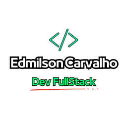

                                                                                                                                 
### Desafios Dio

### Sejam muito bem vindos ! 

 Aqui começa uma jornada de muito aprendizado e desafio! Aqui você encontrará uma coleção de desafios projetados para testar e aprimorar suas habilidades de programação. Cada desafio é uma oportunidade para praticar algoritmos, lógica e solução de problemas.

#### Metodologia de apresentação

Para facilitar a compreensão da proposta do desafio e expor meu aprendizado, cada pasta do repositório conterá (além do código fonte) um arquivo Readme abordando os seguintes tópicos:

----

* **Proposta do Desafio**:  Nesta seção, você encontrará detalhes sobre o desafio proposto. Lembre-se de ler com atenção para entender a proposta avaliar os caminhos que escolhi para o desenvolvimento do código.  

* **Bônus**: Os desafios não se limitam apenas à proposta básica. Aqui, exponho os pontos do código ao qual me aprofundei. Nesse tópico  eu conto o motivo que me levaram as certas decisões e como lidei com os problemas que fatalmente vão acontecer no momento de codar. 

* **Conclusão**: Ao concluir o desafio,  faço uma reflexão que aprendi e faço uma visão geral sobre o desafio. Tudo de forma simples bem abreviada  para que a leitura fique leve e dinâmica. 

  -----

  

​        Os desafios serão feitos com as <u>mais diversas tecnologias direcionadas a área de atuação do profissional FullStack,</u> começando por linguagens de marcação como Html e Css, linguagens de programação de tipagem dinâmica (JavaScript), FrameWorks e finalizando, com o nosso bom e velho e querido Java no Backend.  

